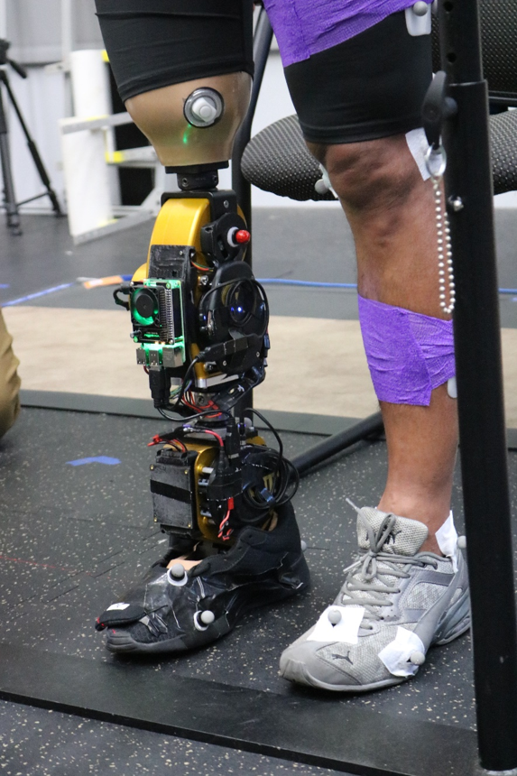
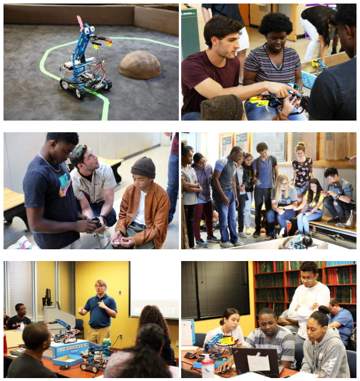
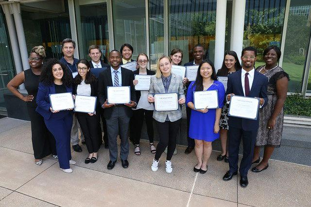

Teaching and sharing my knowledge has always been an amazing and rewarding experience for me. Over the years, I have realized that having the right teacher or mentor can have a really large impact on you! I try to emulate this in my teaching approach and strive to make each experience memorable. I have also tutored many students over the years in math, engineering, and robotics. I want to continue this passion and will strive to provide useful [tutorials/posts](https://kbhakt.github.io/krishan_bhakta//posts/) on this website to learn about new concepts and skills. 

## Biomechatronics of Wearable Robotic Systems

<!-- Useful reference -->
<!-- https://stackoverflow.com/questions/12090472/how-do-i-center-an-image-in-the-readme-md-file-on-github -->

At Georgia Tech I was a TA for this course that introduced students to understanding wearable sensors as well as utilizing machine learning in this domain. The course covered an introduction to the emerging science of human-machine interaction with particular focus on wearable robotic devices for restoration or augmentation of human movement. The course modules also covered basic principles of human neuromechanics and energetics (i.e., the human machine) and gave exposure to the state-of-the-art in mechatronic design of wearable robotic systems. During the workshop, one of my responsibilities was to create a workshop to teach students how to apply machine learning to wearable signals found in lower-limb applications.

## VIP Robotic Human Augmentation Team

At Georgia Tech I was a graduate student mentor for the Vertically Integrated Projects (VIP) program. Specifically, I led the powered prosthesis team for ~ 5 years. I was able to mentor over 75 students over my PhD career. I taught students each semester with design, control, signal processing, machine learning, and evaluation of our powered prosthetic devices. Specifically my team was able to win 1st place at the campus-wide, regional, & global 2020 VIP Consortium Innovation Competition over the span of a couple years. The winning video can be found [here](https://www.youtube.com/watch?v=Fic5vz3W6CI&t=2s).

&nbsp;
&nbsp;
&nbsp;

## Georgia Tech Robotics Summer Scholars Program

We had high school students from all over Atlanta participate in the first annual Georgia Tech Robotics Summer Scholars program. This was hosted by the three labs (EPIC, POWER, and DART) where graduate students served as instructors and helped all the scholars design, code, and test their autonomous rover’s in final competition: [Egyptian Escapade](https://www.youtube.com/watch?v=9ViUc8IZHt0).

&nbsp;
&nbsp;
&nbsp;

## NSF Sure Robotics Program

During each summer of 2018 and 2019, I was able to work with one highly motivated individual interested in engineering and science for an immersive 10 week summer research program. The two research projects I mentored on were “Exploring Techniques for Detecting Intent Recognition for a Powered Knee and Ankle Prosthesis” led by Divya Chowbey and ” Feasibility for Proportional Electromyographic Control of a Knee and Ankle Prosthetic” led by Alex Eichinger-Wiese.

## NMT LLC Robotics Coach

During my undergraduate studies, I was able to mentor new students interested in engineering and robotics. I was able to instruct students to develop, build, and program different robots to accomplish tasks in an end-of-semester competition using Arduino microcontrollers and sensors.

