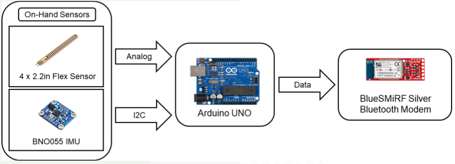

# Gesture Recognition using Smart Glove

This project was a collaboration between 4 students: Dawit Lee, Jared Li, Oludotun Ode, and myself. We worked on this final project for ECE 8833: Biomedical Sensing Systems in the Fall of 2017. The project entailed us utilizing biomedical instrumentation that could be used to solve a real problem. We ended up choosing to create a [“smart glove”](https://youtu.be/maCvKXfcnyE) that could take in certain gestures and display them through an app to communicate effectively with those with certain hearing/speech pathologies. 

## Overall Summary

Effective communication is an important facet of daily life. Unfortunately, this skill is made difficult for a large amount of people in the US due to disorders such as deafness. If severely afflicted, a person’s only available method of interpersonal communication may be American Sign Language (ASL), which less than one percent of the U.S. understands. This divide in communication between the deaf and the rest of the population can be bridged with a device that is portable, easy to use, and is able to translate basic gestures and ASL into text. Many previous devices in this field often involve cumbersome cameras, data processing that can only be done on a desktop, and gloves that use complicated sensors, which make the device difficult to use and understand. We wanted to explore a device that could improve on all of these factors by using a lightweight glove system with few sensors that would be powered by a simple power bank.

## System Overview

The smart glove consisted of two primary sensors: a series of flexible force sensing resistors (FSRs) localized on each finger of the glove except for the ring finger (rarely flexed by itself in the ASL alphabet and most other commonly used gestures) [1] and one BNO055 inertial measurement unit (IMU) on the back of the hand to detect orientation and acceleration [2]. Both sensors were integrated with an Arduino Uno in the controller cuff located on the forearm which sent the data to a smartphone using Bluetooth. The data was then passed through a simple classifier on the phone powered by TensorFlow, which outputted the desired gesture. The smart glove was  able to recognize 10 static gestures: rock, paper, scissors, thumbs-up, thumbs-down, thumb-middle, peace sign, A, L, and I.

## Circuit Design & Software

The entire smart glove was powered using only a 5V power bank plugged directly into the Arduino. All of the sensors (flex sensors, IMU, and Bluetooth module) were routed on a single breadboard and color coded for organizational purposes.  The flex sensors were ported to the analog pins of the Arduino to read a range of values depending on the configuration of the flex sensor. The IMU was read with a I2C interface that read acceleration and Euler angles in the x, y, and z directions. A total of 14 features were captured from the sensors and outputted to the serial monitor, where the Bluetooth module took that data and communicated over to the smartphone.

## Data Collection

The data collection procedure is very straightforward. Each pose is held for around 2 minutes while the 14 features mentioned above are collected. Within this period, the user makes small variations in the gesture such as slight tilting or translation of the hand. This allows for the classifier to learn imperfect inputs and minimize exact positions by the user. This data is then labeled with the correct gesture and fed into the machine learning model. This process of collecting data is easy and can be expanded to new gestures fairly quickly. 

## Machine Learning & Results

The classifier we chose for this project was a neural network using the TensorFlow API in Python [3]. This package was used since it allowed for a quick run-time and ability to easily export the model to a smartphone. The model architecture comprised of a 14 input node layer connected to 2 hidden layers with 30 and 20 neurons respectively and finally a 10 output node layer that would predict the gesture. From the data collected above, 80% of data was used for training, 10% used for validation, and 10% withheld for final testing. 

There were multiple results collected. The first stage was to be able to distinguish between rock, paper, and scissors. By utilizing only Euler angles, the classification accuracy was 95%. When including the rest of the gestures (thumb signs and ASL letters) the accuracy dropped to around ~80%. We figured that since certain signs were similar in pose, the feature data was not very distinct between these separate classes. To remedy this, we added acceleration features in addition to orientation features (Euler angles) which brought the accuracy back to  between 90-95%. 

## Conclusion

We were able to create a “smart glove” that could distinguish between different gestures using machine learning and wearable sensors. Some limitations of this project included: only testing with 1-2 individuals when collecting the training data, and picking a set of distinct gestures to classify. Future work could expand at collecting more data to make a more generalizable model to novel subjects as well as expanding the number of different gestures that could be recognized. 

## References
[1] Adafruit.com. SpectraSymbol Flex Sensor 2 inch datasheet. [Online]. Available: HTTPS://CDN-SHOP.ADAFRUIT.COM/DATASHEETS/SPECTRAFLEX2INCH.PDF

[2] Adafruit.com. BNO055 Absolute Orientation Sensor. [Online]. Available: HTTPS://LEARN.ADAFRUIT.COM/ADAFRUIT-BNO055-ABSOLUTE-ORIENTATION-SENSOR/OVERVIEW

[3] https://www.tensorflow.org/lite

